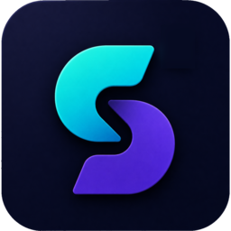

<div align="center">



# squeeze

</div>

A Windows tool that compresses NVIDIA ShadowPlay clips to a size Discord will
accept.

Drag clips onto the window and pick a size limit. Each one is re-encoded to fit
under it and saved next to the original with a `_discord` suffix — `clip.mp4`
becomes `clip_discord.mp4`. Originals are left alone.

<!-- TODO: screenshot of the app with a couple of files queued goes here -->

## Install

Download `squeeze.exe` from the
[latest release](https://github.com/kayex/squeeze/releases/latest) and run it.

The first time you do, Windows will show *"Windows protected your PC"* and an
unknown publisher — click **More info → Run anyway**. This is because the app
isn't code-signed. If you'd rather check the file first, see
[verifying a download](#verifying-a-download).

## Requirements

- Windows 10 or 11, 64-bit
- An NVIDIA GPU with driver 570 or newer, for hardware encoding. Without one,
  squeeze encodes in software instead — slower, same output.

## Usage

1. Open `squeeze.exe`.
2. Drag one or more clips onto the window, or onto the `.exe` itself in Explorer.
3. Pick a size limit: **10 MB** (Discord free), **50 MB** (Nitro Basic) or
   **500 MB** (Nitro).

Reads MP4 and MKV containing H.264, HEVC or AV1, which covers what ShadowPlay
records. Writes H.264 MP4.

## What happens to your clip

The size limit and the length of the clip decide everything else: a fixed number
of bytes spread over more seconds means fewer bits per second, and below a
certain point it's better to send fewer or smaller frames than to send blurry
ones.

1. **Measure** — duration, resolution and frame rate are read from the file.

2. **Work out the bitrate** — roughly `size limit ÷ duration`, minus what the
   audio needs, and aiming a little under the limit for safety. A 30-second clip
   at 10 MB gets about 2.3 Mbit/s of video; two minutes at the same limit gets
   about 500 kbit/s.

3. **Pick a resolution** — 1440p and 4K are kept when there's plenty of bitrate
   to go round (above ~10 Mbit/s) and come down to 1080p when there isn't.
   Below ~1.6 Mbit/s it drops again to 720p, and below ~700 kbit/s to 480p.
   Clips are never enlarged.

4. **Pick a frame rate** — anything above 45 fps is halved to 30 when the
   bitrate is under ~3 Mbit/s, which is the usual case for clips longer than
   about 20 seconds at 10 MB. Tick **Keep original frame rate** (or pass
   `--keep-fps`) to override this. Variable frame rate, which ShadowPlay
   records, is converted to constant.

5. **Encode** — H.264, with the original audio track copied across rather than
   re-compressed. Encoding runs on the GPU where possible.

6. **Check and retry** — the finished file is measured, and if it came out over
   the limit it's encoded again at a lower bitrate, up to three attempts. This
   is why the result reliably fits rather than approximately fits.

The window shows the resolution and frame rate it settled on for each clip, so
you can see when something has been scaled down. As an example, a 30-second
1440p60 clip aimed at 10 MB comes out 1080p30; the same clip aimed at 50 MB
stays 1440p60.

## Command line

`squeeze-cli.exe`, in the release zip, does the same thing without the window:

```powershell
squeeze-cli.exe --max-mb 10 "C:\Videos\clip.mp4"
```

| option | |
|---|---|
| `--max-mb <MB>` | Size ceiling (default `10`) |
| `--encoder <E>` | `auto` \| `nvenc` \| `x264` \| `openh264` (default `auto`) |
| `--passes <N>` | Max re-encode attempts (default `3`) |
| `--suffix <S>` | Output suffix (default `_discord`) |
| `-o, --outdir <DIR>` | Output directory (default: next to the input) |
| `--keep-fps` | Don't cap 60fps → 30fps when the budget is tight |
| `--no-audio` | Drop audio instead of copying it |

## Verifying a download

Checksums are listed in each release's notes:

```powershell
certutil -hashfile squeeze.exe SHA256
```

Builds are produced by GitHub Actions, so you can also confirm a file came from
this repository's workflow:

```powershell
gh attestation verify squeeze.exe -R kayex/squeeze
```

## Building from source

See [docs/development.md](docs/development.md).

## Licence

MIT — see [LICENSE](LICENSE). squeeze links the FFmpeg libraries under the
LGPL v2.1, built without GPL or non-free components.
